# task 2

## Description

Dissasembling a complex and protected binary files
1. Disassemble it using IDA Pro, Ghidra or Radare2.
2. Find and understand the basic logic of the program.
3. Determine which protective mechanisms (obfuscation, packing, anti-debugging) are used.
4. Bypass the protection and restore the program's algorithm.
5. Change the program's behavior (for example, remove the license check or change the input/output).
6. Реализовать поиск вредоносных признаков: поиск аномальных импортов и выявление самозашифрованных секций
7. Sources: https://challenges.re/, https://bazaar.abuse.ch/, https://www.flare-on.com/ 

## Solution

1. Installed Kali Linux distribution within VirtualBox VM, in order to prevent some issues with files from untrusted sources. For the analysis, applied [Ghidra](https://github.com/NationalSecurityAgency/ghidra) toolkit (from github source or as package `sudo apt install ghidra`) for disassembly and decompilation of different binary formats. As a source, used task from [crackmes.one platform](https://web.archive.org/web/20250216185230/https://crackmes.one/crackme/5b8a37a433c5d45fc286ad83)
2. After downloading the file, it is required to unzip it: `unzip -P crackmes.one file_name.zip`
3. There is ELF executable builded in C/CPP, which require some password as parameter to be passed.
  - 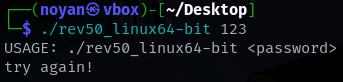
4. Started Ghidra and imported file via `ctrl + i / import file button and selected rev50_linux64-bit`. It automatically analysed file format and its properties (also `file` command utility in linux can do that).
  - 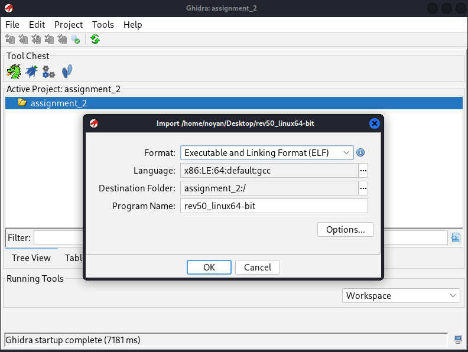
  - 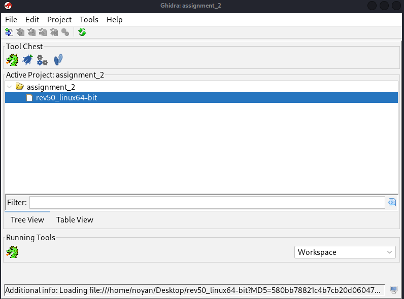
5. Then, we need to configure automatic analysis and analyzers. It will decompile and disassemble all valuable parts of the source.
  - 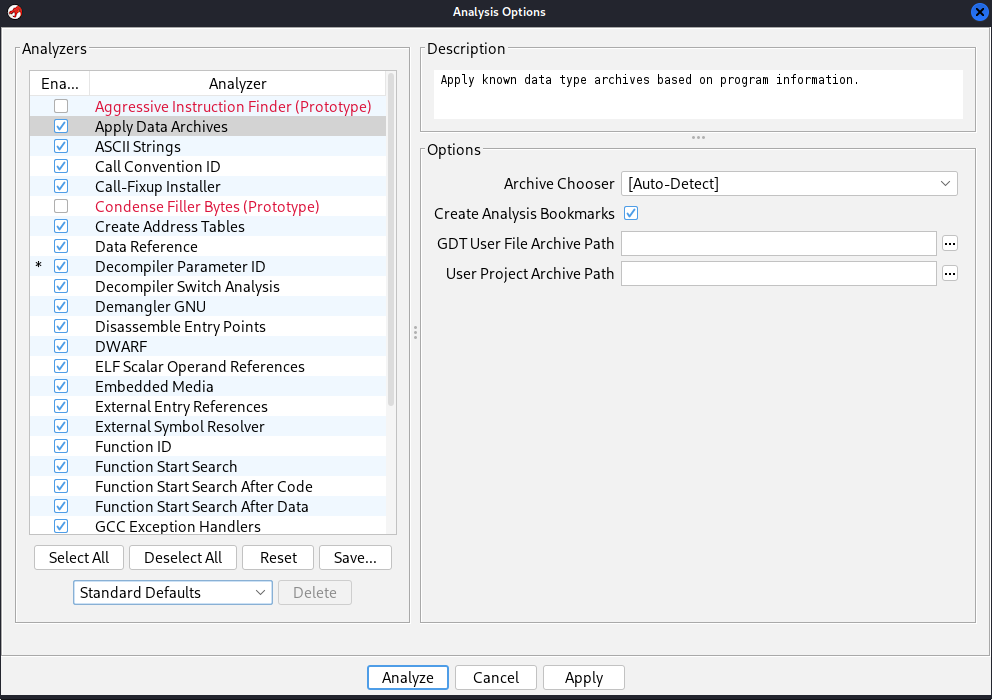
6. As we can see here, Ghidra formed program tree of the all functions, libraries, and other parts. The most interesting part for us is entry point with _start() or main() where starting code is located. There is simple logic for validation of second param from argv (length is equal to 10 and 5th symbol of the string must be `@`, so it will pass the flag - in other case it leads to function usage() with process termination via exit(1)). In order to easily understand decompiled code, we could edit some parts and change function signature.
  - 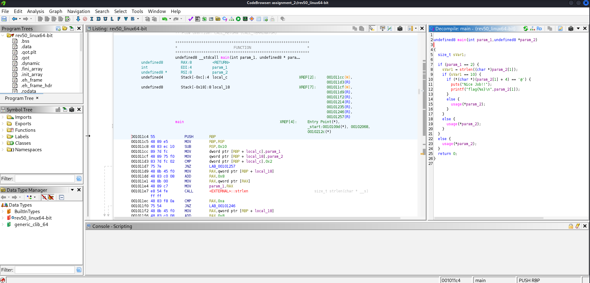
  - 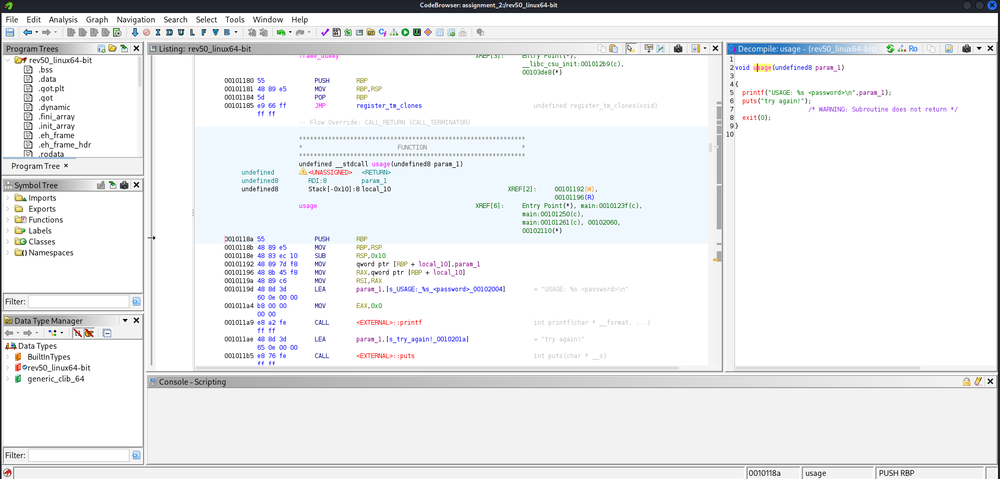
  - 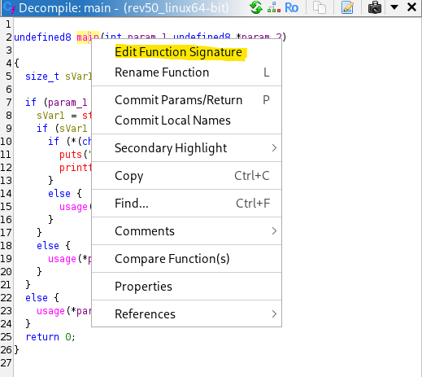
  - 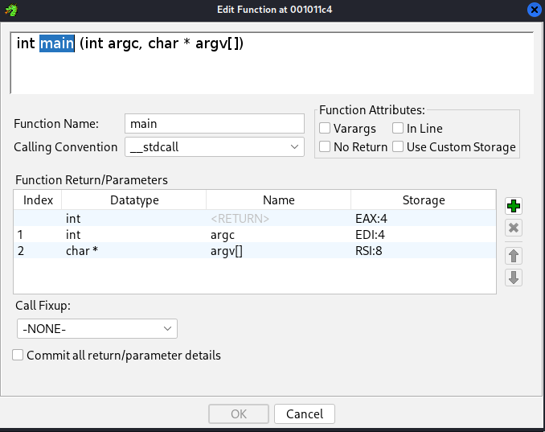
  - 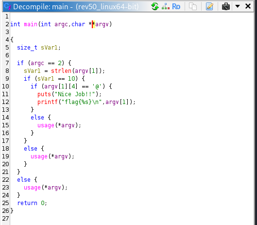
  - 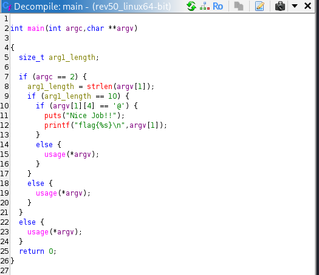
7. We understood how program works, so it is possible to modify the source and recompile with GCC: `gcc -o ./build/rev50_linux64.o rev50_linux64.c`
  - 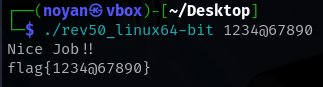
