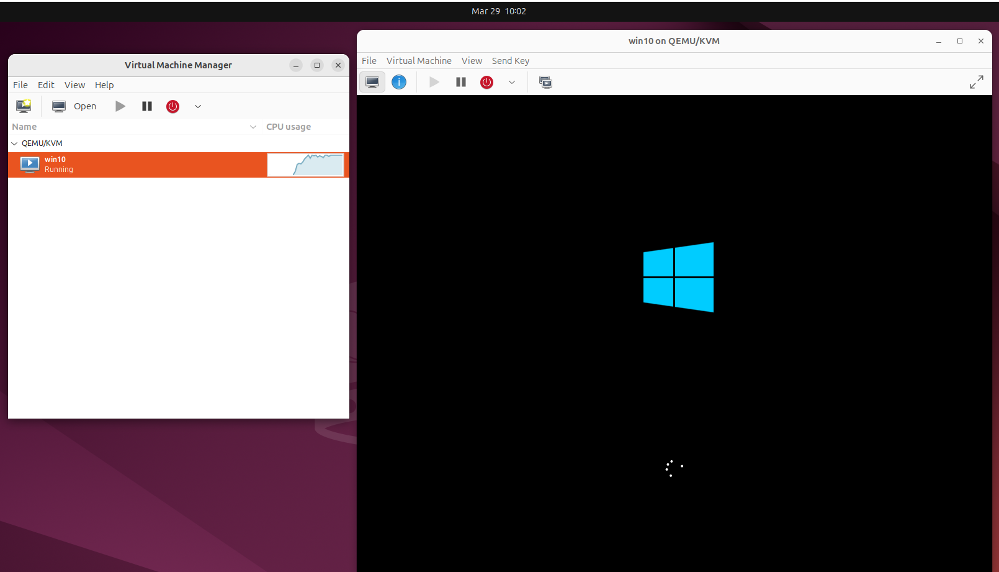
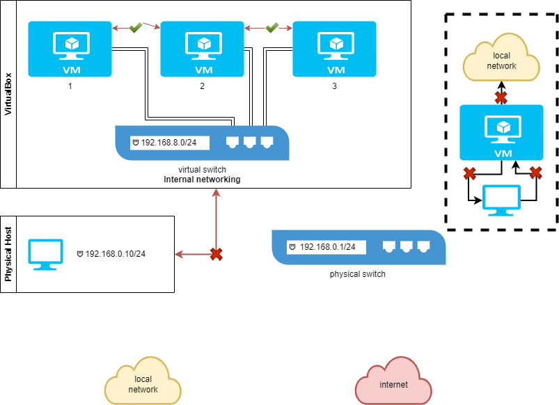
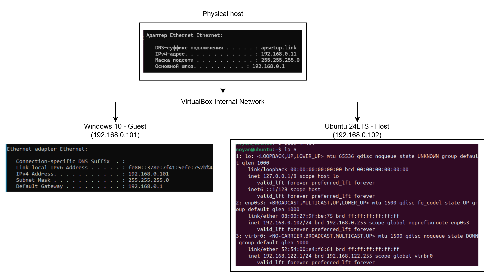
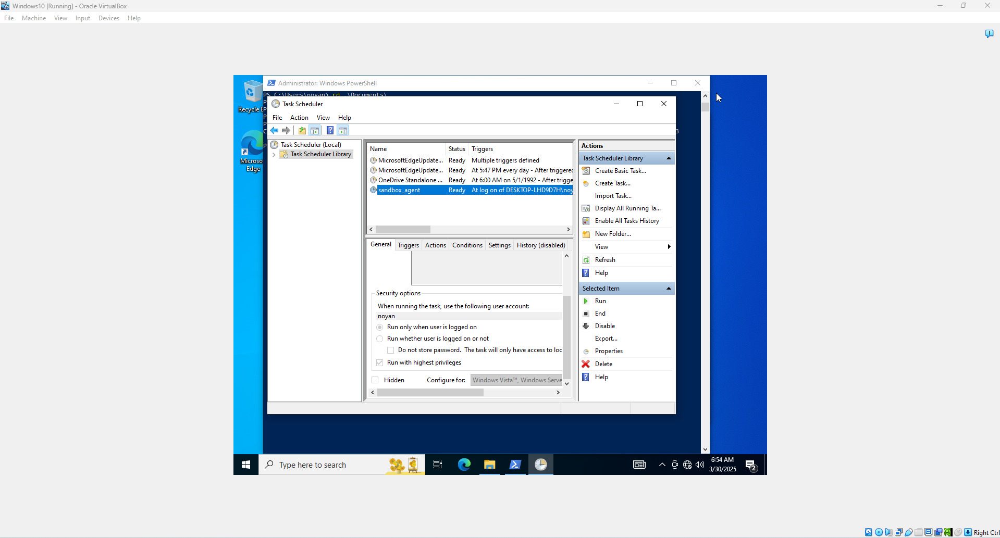
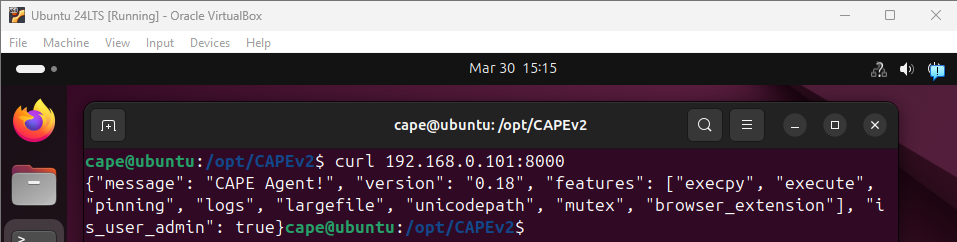
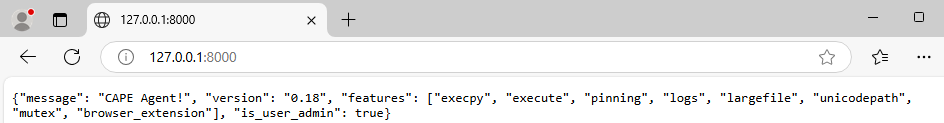
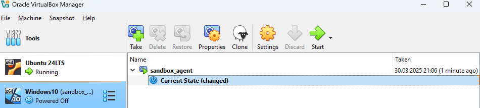
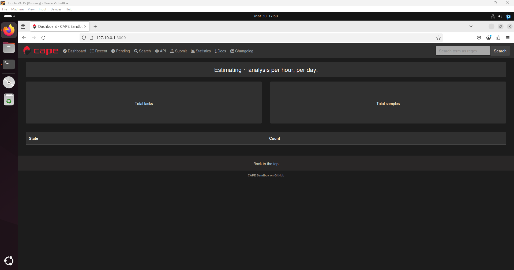
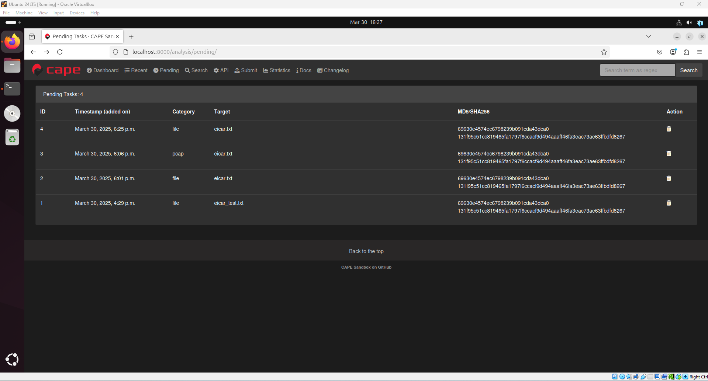

# Task 3 - Dynamic Malware Analysis

## Description
Advanced techniques of dynamic malware analysis:
- Malware techniques and contermeasures
- Sandboxes
- Bypassing anti-debugging techniques
- API tracing
- Network interaction analysis
Files: 
- [EICAR Test File](https://www.eicar.org/download-anti-malware-testfile/) - safe test file for antivirus experiments
- [UPX Sample](https://github.com/HHousen/PicoCTF-2022/raw/refs/heads/master/Reverse%20Engineering/unpackme/unpackme-upx) - UPX-packed binary file / self-created UPX

## Solution
### Configuring sandbox
1. Configured Ubuntu 24.04 LTS Linux inside Oracle VirtualBox as virtual environment. Then downloaded latest Windows 10 ISO image and installed it inside as proper VM in KVM. Used [CAPEV2](https://github.com/kevoreilly/CAPEv2) or could applied [Cuckoo3](https://github.com/cert-ee/cuckoo3), because original Cuckoo Sandbox is archived project and outdated (Python 2.7 version). There are also alternatives via SaaS services for automated malware analysis, like in VirusTotal - https://docs.virustotal.com/docs/external-sandboxes and https://docs.virustotal.com/docs/in-house-sandboxes. 
2. Install KVM/QEMU/LibVirt with virt-manager: `wget https://raw.githubusercontent.com/kevoreilly/CAPEv2/refs/heads/master/installer/kvm-qemu.sh`, then replace all '<WOOT>' to random 4 chars due to lab environment via sed or awk: `sed -i 's/<WOOT>/1234/g' kvm-qemu.sh`. Then, add chmod to file `sudo chmod a+x kvm-qemu.sh` and install `sudo ./kvm-qemu.sh virtmanager <username> | tee kvm-qemu-virt-manager.log`. Usually, everything is done by `sudo apt update && sudo apt install virt-manager -y`, but there is some issues with CAPEv2 dependencies. Reboot the system and start virt-manager: `virt-manager`. 
- Install CAPEv2: `wget https://raw.githubusercontent.com/kevoreilly/CAPEv2/refs/heads/master/installer/cape2.sh`, then `sudo chmod a+x cape2.sh`, `./cape2.sh -h`, `sudo ./cape2.sh all cape | tee cape.log`, reboot system. Login as `sudo su - cape -c /bin/bash`, configure: `cd /opt/CAPEv2/`, `poetry install`, and start host.
3. Configuring guest VM: There was problem that VM was too slow in KVM, therefore installed as separate Windows 10 instance in VirtualBox and configured external connection.
  - Install python3 x32, `python -m pip install --upgrade pip`, `python -m pip install Pillow==9.5.0`, apply [win10_disable.ps1](https://github.com/kevoreilly/CAPEv2/blob/master/installer/win10_disabler.ps1) with `Set-ExecutionPolicy -ExecutionPolicy Unrestricted -Scope CurrentUser`. Then to make VMs connect to each other in VirtualBox: Settings -> Network -> Internal Network, Allow All -> and configure ip addresses (`sudo nmtui` in linux / network center in windows) -> check via `ip a` and `ipconfig` or `ifconfig`.
    - How internal network works in VirtualBox: 
    - Scheme of network topology: 
  - Start agent.pyw and check connection. Then, apply that process to task scheduler.
    - 
    - 
    - 
  - Additionally, debloat Windows 10 and turn off other services.
  - Create snapshot of guest VM: Machine -> Take snapshot -> Start from snapshot or restore state: 
4. Configure /opt/CAPEv2/conf/*:
  - api.conf, auxiliary.conf, cuckoo.conf, physical.conf
  - Restart all cape processes: sudo systemctl restart cape*
  - Open web CAPEv2: `http://127.10.0.1:8000/`
    - 
    - 
5. Analysis within Cuckoo Sandbox: https://www.cuckoo.ee/analysis/6202123/summary/

### Bypassing Anti-Debugging Techniques

Identify anti-debugging calls (IsDebuggerPresent, NtQueryInformationProcess).
Modify the executable code (NOP out CheckRemoteDebuggerPresent).
Relaunch upx_sample.exe and verify execution under the debugger.
Result: A modified file that runs successfully under debugging conditions.
`file unpackme-upx > file_unpackupx.txt`
`sudo apt install binutils`, `strings unpackme-upx > strings_unpackme.txt`
chmod +x unpackme-upx
hexdump, objdump, ltrace / strace (sudo apt install ltrace) - strace ./unpackme-upx | tee strace_unpackmeupx.txt # TODO: need to pass all strace
sudo apt install upx-ucl or https://github.com/upx/upx/releases/ -> tar extract tar.xz -> chmod +x upx -> ./upx -d unpackme-upx
