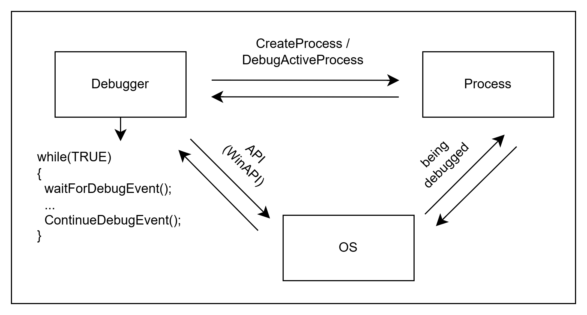
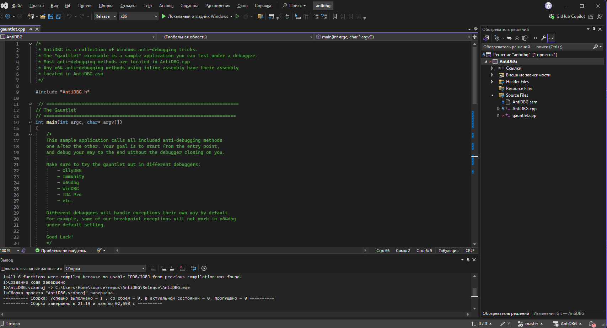
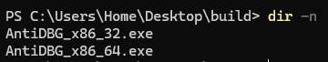

# Task 5 - Anti-debugging techniques

## Description and theory
- Objectives of this task is:
  1. To learn how to identify, understand, implement, and bypass anti-debugging mechanisms by using debugger and other tools for analysis.
  2. To disable protection in executable files via developing binary patches or manually.
- Many protected programs or proprietary software (DRM, malware, cracked software, antiviruses, etc.) use anti-debugging, obfuscations, and other protection techniques to prevent reverse engineering. Their goals is to detect and disrupt debugging attempts, making analysis harder. For example, a binary could be confusing and deliberately messy without function identifications, meaningful names or strings, constants, debug information, and so on.
- Debugger ("отладчик") - software for dynamic analysis of other programs (searching for errors or specific logic / behavior in runtime):
  1. Main functionality: step by step code execution (by instruction or lines), set breakpoints, inspect and modify variable values in running application.
  2. Some types of debuggers:
       - Source-level (within IDE itself, like VSCode or Visual Studio) and low-level debuggers (x64dbg/x32dbg, OllyDBG, Immunity Debugger, WinDBG, GDB, etc.).
       - Application level and kernel level (connecting remotely or within separate VM, because any critical error or something happens could lead to system crashes).
  3. Usually, it is necessary / usefull to use various tools or their combinations, as they might handle exceptions or certain blocks of code differently by default. For example, it can lead to issues with breakpoints as in x64dbg under the default settings. There are also plugins available for integrating debuggers into disassemblers and decompilers (e.g., Gx64Sync, x64dbgida). Additionally, a range of other useful tools can be applied, including PE-bear (a PE structure analyzer), CFF Explorer and HxD (PE and hex editors), ScyllaHide or TitanHide (plugins for concealing the presence of a debugger), etc. In some cases, the functionalities of these tools may overlap - a disassembler might already include certain built-in debugging features and so on.
  4. Basically, low-level debuggers in Windows OS, like x64dbg/x32dbg, consists of several components: graphical user interface (based on QT, GTK, or another GUI framework) and engine (core component responsible for interaction OS API/ABI functions with processes and executing some operations).
     - Debugging functionality in Windows OS is done by API functions (Windows Debugging API) for native debugging process.
     - Debugging starts from: starting debugged proccess in a special way (CreateProcess) or attaching to an existing process (DebugActiveProcess). After that, debugger is attached to the process and the dependency is established: parent process and child process. If the debugger terminates, the debugged process also terminates.
     - Debugger runs / operates in a loop that continues until a debug event is caught. When such an event occurs, the execution of the target process is suspended, and the process remains paused until the debugger allows it to resume (this is also how breakpoints work). The debugger can interact with the program via an API, and the operating system itself will return debugging information to the debugger. Debug events are large data structures that include the process context and other details that are sent to the debugger. The debugger initiates a loop in which it listens for the occurrence of debugging events / states reported by the system.
       1. Event handling - main function responsible for processing events: WaitForDebugEvent(), ContinueDebugEvent().
       2. Functions for modifying context - Thread Context is a set of registers and flags that are saved during program execution: GetThreadContext() / Wow64GetThreadContext(), SetThreadContext() / Wow64SetThreadContext(), others
     - [PEB (Process environment block)](https://www.aldeid.com/wiki/PEB-Process-Environment-Block) - a process structure containing information about the environment, startup parameters, and base address. [TEB (Thread environment block)](https://www.aldeid.com/wiki/TEB-Thread-Environment-Block) - a structure containing information about a thread in the current process. Each thread has its own separate TEB.
     
     - Sources:
       - https://learn.microsoft.com/en-us/windows/win32/debug/writing-the-debugger-s-main-loop
       - https://learn.microsoft.com/en-us/windows/win32/debug/debugging-functions
       - https://learn.microsoft.com/en-us/archive/msdn-magazine/2011/march/msdn-magazine-debugger-apis-writing-a-debugging-tools-for-windows-extension
       - https://learn.microsoft.com/ru-ru/windows/win32/debug/debugging-functions
       - https://learn.microsoft.com/en-us/windows/win32/api/minwinbase/ns-minwinbase-debug_event
       - https://learn.microsoft.com/en-us/windows/win32/api/debugapi/nf-debugapi-debugactiveprocess
       - https://learn.microsoft.com/en-us/windows/win32/debug/debugging-a-running-process
       - https://learn.microsoft.com/en-us/windows/win32/debug/process-functions-for-debugging
       - https://github.com/x64dbg/x64dbg/blob/development/src/dbg/debugger.cpp#L2762
       - https://github.com/x64dbg/TitanEngine/blob/26745403689bdd470f2689f629085f45340225a3/TitanEngine/TitanEngine.Debugger.DebugLoop.cpp#L103C5-L103C41

## Solution and practice
1. For the practice session, analysed only Windows OS anti-debugging techniques (both x86_32 and x86_64). In this case, used training repository with protected C/C++ application - https://github.com/HackOvert/AntiDBG/. This application calls various anti-debugging methods and tricks sequentially - our goal is to start from the entry point and debug all tasks until the end (it will show text message and finish with successful execution - EXIT_SUCCESS or return 0). It contains memory checks, CPU checks, timing checks, exceptions checks, and others. In order to properly build and compile source in Windows, we need Visual Studio or MinGW or Clang: build `release` or `debug` (ctrl+shift+B) for both `x86` and `x64`, because they create / output some different binaries (also it depends on optimizations, architecture details, compilers, etc.). Output binaries (.exe / PE) can be found in `/Release` or `/Debug` within the project directory.

common anti-debugging techniques / Identify and bypass the anti-debugging mechanism.
IsDebuggerPresent - WinAPI call to detect presence of a debugger.
CheckRemoteDebuggerPresent - Another function used to check debugger attachment.
NtQueryInformationProcess - Retrieves debug flags like DebugPort.
SEH + Exceptions - Custom exception handling that breaks in debuggers.
INT3, ICEBP, UD2 - Triggers breakpoints or invalid instructions.
Timing Checks - Detects delays caused by single-stepping.
DRx Register Checks - Detects hardware breakpoints used by debuggers.
- Create a binary patch to disable protection.
Document the bypass method and patched offsets.
From API checks to tricky exceptions, attackers and protectors use a wide range of techniques
Проверка флагов в регистре PEB.
Использование инструкции INT 3 для ловушек.
Использование GetTickCount() или QueryPerformanceCounter() для проверки времени реакции.
Разработка патча, например отключить антиотладочную  функцию 
