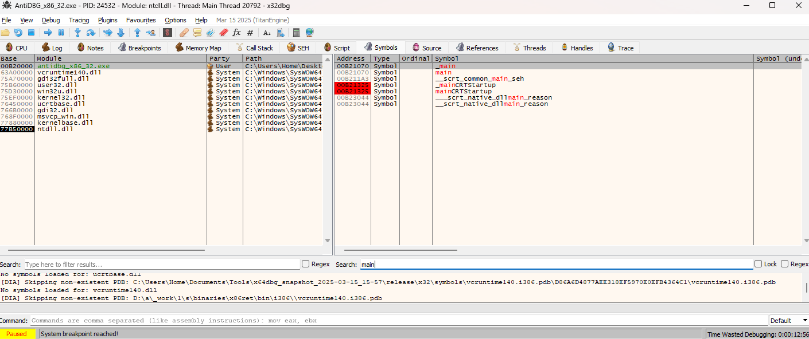

# Task 5 - Anti-debugging techniques

## Description and theory
- Objectives of this task is:
  1. To learn how to identify, understand, implement, and bypass anti-debugging mechanisms by using debugger and other tools for analysis.
  2. To disable protection in executable files via developing binary patches or manually.
- Many protected programs or proprietary software (DRM, malware, cracked software, antiviruses, etc.) use anti-debugging, obfuscations, and other protection techniques to prevent reverse engineering. Their goals is to detect and disrupt debugging attempts, making analysis harder. For example, a binary could be confusing and deliberately messy without function identifications, meaningful names or strings, constants, debug information, and so on.
- Debugger ("отладчик") - software for dynamic analysis of other programs (searching for errors or specific logic / behavior in runtime):
  1. Main functionality: step by step code execution (by instruction or lines), set breakpoints, inspect and modify variable values in running application.
  2. Some types of debuggers:
       - Source-level (within IDE itself, like VSCode or Visual Studio) and low-level debuggers (x64dbg/x32dbg, OllyDBG, Immunity Debugger, WinDBG, GDB, etc.).
       - Application level and kernel level (connecting remotely or within separate VM, because any critical error or something happens could lead to system crashes).
  3. Usually, it is necessary / usefull to use various tools or their combinations, as they might handle exceptions or certain blocks of code differently by default. For example, it can lead to issues with breakpoints as in x64dbg under the default settings. There are also plugins available for integrating debuggers into disassemblers and decompilers (e.g., Gx64Sync, x64dbgida). Additionally, a range of other useful tools can be applied, including PE-bear (a PE structure analyzer), CFF Explorer and HxD (PE and hex editors), Winlister and Process Explorer (processes listing), ScyllaHide or TitanHide (plugins for concealing the presence of a debugger), etc. In some cases, the functionalities of these tools may overlap - a disassembler might already include certain built-in debugging features and so on.
  4. Basically, low-level debuggers in Windows OS, like x64dbg/x32dbg, consists of several components: graphical user interface (based on QT, GTK, or another GUI framework) and engine (core component responsible for interaction OS API/ABI functions with processes and executing some operations).
     - Debugging functionality in Windows OS is done by API functions (Windows Debugging API) for native debugging process.
     - Debugging starts from: starting debugged proccess in a special way (CreateProcess) or attaching to an existing process (DebugActiveProcess). After that, debugger is attached to the process and the dependency is established: parent process and child process. If the debugger terminates, the debugged process also terminates.
     - Debugger runs / operates in a loop that continues until a debug event is caught. When such an event occurs, the execution of the target process is suspended, and the process remains paused until the debugger allows it to resume (this is also how breakpoints work). The debugger can interact with the program via an API, and the operating system itself will return debugging information to the debugger. Debug events are large data structures that include the process context and other details that are sent to the debugger. The debugger initiates a loop in which it listens for the occurrence of debugging events / states reported by the system.
       1. Event handling - main function responsible for processing events: WaitForDebugEvent(), ContinueDebugEvent().
       2. Functions for modifying context - Thread Context is a set of registers and flags that are saved during program execution: GetThreadContext() / Wow64GetThreadContext(), SetThreadContext() / Wow64SetThreadContext(), others
     - [PEB (Process environment block)](https://www.aldeid.com/wiki/PEB-Process-Environment-Block) - a process structure containing information about the environment, startup parameters, and base address. [TEB (Thread environment block)](https://www.aldeid.com/wiki/TEB-Thread-Environment-Block) - a structure containing information about a thread in the current process. Each thread has its own separate TEB.
     
     - Sources:
       - https://learn.microsoft.com/en-us/windows/win32/debug/writing-the-debugger-s-main-loop
       - https://learn.microsoft.com/en-us/windows/win32/debug/debugging-functions
       - https://learn.microsoft.com/en-us/archive/msdn-magazine/2011/march/msdn-magazine-debugger-apis-writing-a-debugging-tools-for-windows-extension
       - https://learn.microsoft.com/ru-ru/windows/win32/debug/debugging-functions
       - https://learn.microsoft.com/en-us/windows/win32/api/minwinbase/ns-minwinbase-debug_event
       - https://learn.microsoft.com/en-us/windows/win32/api/debugapi/nf-debugapi-debugactiveprocess
       - https://learn.microsoft.com/en-us/windows/win32/debug/debugging-a-running-process
       - https://learn.microsoft.com/en-us/windows/win32/debug/process-functions-for-debugging
       - https://github.com/x64dbg/x64dbg/blob/development/src/dbg/debugger.cpp#L2762
       - https://github.com/x64dbg/TitanEngine/blob/26745403689bdd470f2689f629085f45340225a3/TitanEngine/TitanEngine.Debugger.DebugLoop.cpp#L103C5-L103C41

## Solution and practice
1. For the practice session, analysed only Windows OS anti-debugging techniques (both x86_32 and x86_64). In this case, used training repository with protected C/C++ application - https://github.com/HackOvert/AntiDBG/. This application calls various anti-debugging methods and tricks sequentially - our goal is to start from the entry point and debug all tasks until the end (it will show text message and finish with successful execution - EXIT_SUCCESS or return 0). It contains memory checks, CPU checks, timing checks, exceptions checks, and others. In order to properly build and compile source in Windows, we need Visual Studio or MinGW or Clang: build `release` or `debug` (ctrl+shift+B) for both `x86` and `x64`, because they create / output some different binaries (also it depends on optimizations, architecture details, compilers, etc.). Output binaries (.exe / PE) can be found in `/Release` or `/Debug` within the project directory.

2. Debugging and patching in x64dbg/x32dbg and windbg. Load binary to program -> start from looking for main function / entry point (_main, main, _start, etc.) via Symbols or Memory map then CTRL+G (go to expression address), F9 - run, F8 - step over, F2 - set breakpoint, F7 - step into, Ctrl+F2 - restart, Space - assemble (change assembler instructions) and ctrl+backspace to undo modification. Save patched executable via File - Patch file - Select all - Patch file.

3. Common anti-debugging / anti-static analysis / anti-VM techniques:
    1. WinAPI calls (#include <Windows.h>):
        - [IsDebuggerPresent](https://learn.microsoft.com/en-us/windows/win32/api/debugapi/nf-debugapi-isdebuggerpresent) - detect presence of a debugger by checking bool field BeingDebugged in PEB structure - `example_1_1.c`. Patching and debugging: find address of call to IsDebuggerPresent -> replace conditional jump with jump / set EAX to 0 before test or in test / replace call and conditional jump with NOP.
        - [CheckRemoteDebuggerPresent](https://learn.microsoft.com/en-us/windows/win32/api/debugapi/nf-debugapi-checkremotedebuggerpresent) - also check debugger attachment, check if DebugPort is not equal to 0 by calling to [NtQueryInformationProcess](https://learn.microsoft.com/en-us/windows/win32/api/winternl/nf-winternl-ntqueryinformationprocess), which retrieves debug flags like DebugPort. Patching and debugging: TODO
        - [FindWindow](https://learn.microsoft.com/en-us/windows/win32/api/winuser/nf-winuser-findwindowa) - find window with specific name, can be used to identify active debugger - `example_1_2.c`. Patching and debugging: TODO
        - [OutputDebugString (depricated)](https://learn.microsoft.com/en-us/windows/win32/api/debugapi/nf-debugapi-outputdebugstringw) - write message to debugger, if no debugger then raise exception / error - `example_1_3.c`. Not supported or handles incorrectly in some old versions of debuggers. Patching and debugging: TODO
        - Timing checks (detects delays caused by single-stepping) - GetTickCount, GetLocalTime, GetSystemTime, timeGetTime, NtQueryPerformanceCounter, rdtsc (Read Time Stamp Counter) timecount
    2. Hardware breakpoints:
        - In x86_32: Dr0, Dr1, Dr2, Dr3. Done by comparison of values in registers, CONTEXT ctx is set of registers, flags, process information for execution - `example_3.c`. Patching and debugging: TODO
    3. Software breakpoints:
        - Replacing first byte of instruction with 0xCC byte (machine code instruction to invoke break point / uninitialized stack memory or INT 3 ), as the program reaches it - it recognizes that it has hit a breakpoint and then restores the original by replacing byte. Because, the program knows in advance how many 0xCC bytes it has in a specific memory region. Patching and debugging: TODO
    4. Memory breakpoints:
        - Executed program under a debugger, so debugger has certain rights to access the memory pages of the executed process, normal process does not. Program creates a memory page / guard pages (PAGE_GUARD) and indicates that the memory page is protected, then accesses it, and if an exception or some other situation occurs (STATUS_GUARD_PAGE_VIOLATION), then the program considers that it is not debuggable. And if such an Exception does not occur - the program continues to work under the debugger. Patching and debugging: TODO
    5. Self-debugging - program can debug itself and integrity of the code (like reflection) via certain checking algorithms (hashes: sha, crc32, etc.) by pieces. It is used, because most of above API functions and checks are easily bypeassed and simply removed via NOP. For example, we could break the code into sections of 1024 bytes and check each by crc32 and then compare with the standard value if at some point it changes, then we say that the program will not work.
    6. Others: SEH + Exceptions - Custom exception handling that breaks in debuggers. INT3, ICEBP, UD2 - Triggers breakpoints or invalid instructions. Использование инструкции INT 3 для ловушек. DRx Register Checks - Detects hardware breakpoints used by debuggers. Проверка флагов в регистре PEB - Флаги: Trap flag, Isdebugged, NtGlobalFlag, Heap Flags.
