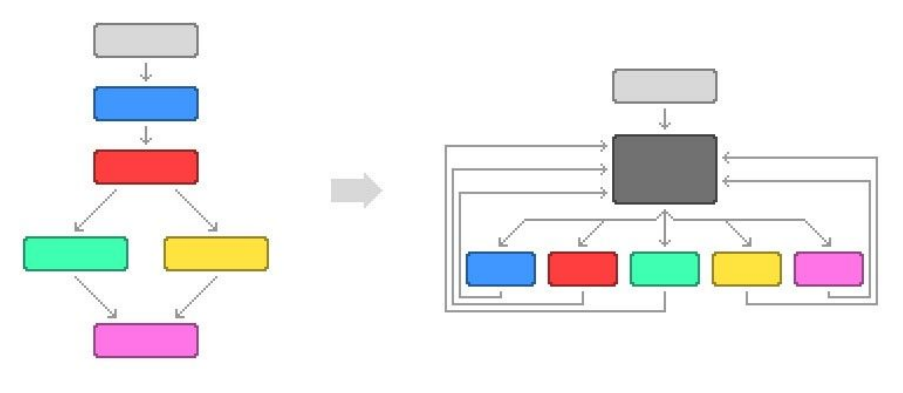
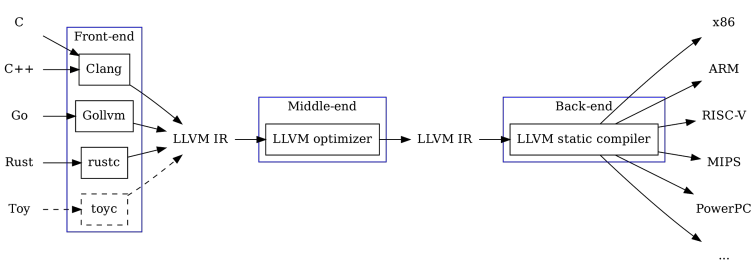
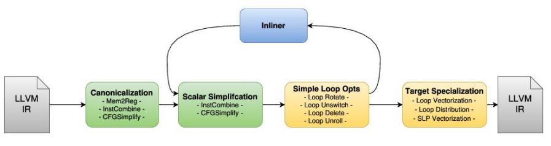
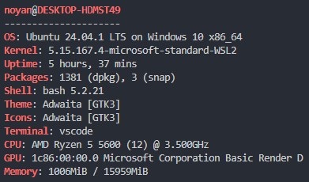
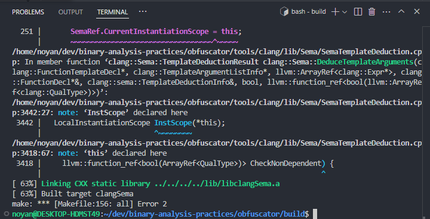
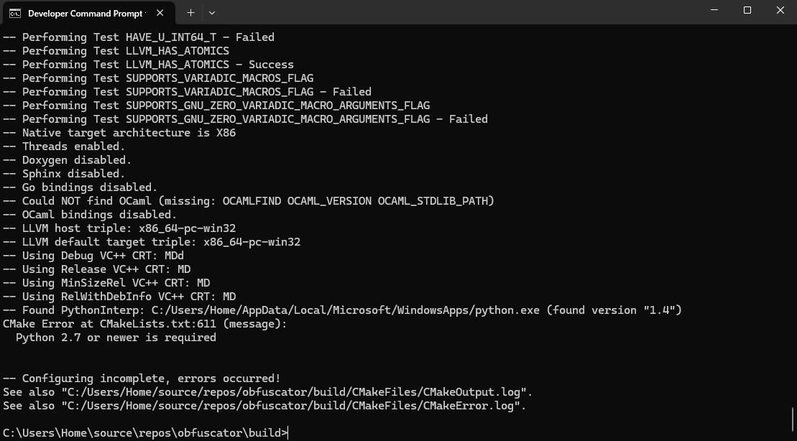
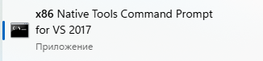

# Task 7 - Code obfuscation in C/C++

## Description and theory
1. Objective - learn how to apply code obfuscation techniques making source harder to read or analyze to protect logic from reverse engineering.
2. Software obfuscation - method of making software / program more difficult for someone else to understand, analyze its logic and what code is doing, and reverse engineer. This modification can be applied at various different levels and areas of the program with different methods (depends on kind of programming language or execution context - interpreted and compiled languages, high-level and low-level languages): source code, intermediate representation / code (e.g., bytecode which is than interpreted by virtual machine), machine code instructions (x86, ARM, etc.). There are multiple reasons for obfuscation:
   - Protecting intellection property ([DRM and copy protection mechanisms](https://en.wikipedia.org/wiki/Digital_rights_management)) - defense in depth, hiding bugs, and so on. Usually, it is done as s temporary measure to prevent immediate access to source code - to delay competitors or others from creating crack or bypass-serving. However, it doesn't guarantee full protection, only a time-limited barrier.
   - Malware development - aimed at complicating analysis, both by reducing detection rates from antivirus/antimalware tools and hindering malware analysts.
   - Performance reasons - minified JS code, bundles, etc.
3. Categories of obfuscation techniques - obfuscation can have possible performance impact on the application depending on applied techniques (from barely noticeable to huge impact). It can be applied either to the entire program or only specific parts of it. It is crucial to consider what you are trying to protect against (automated analysis program, human analysts, or both of them) and how to achieve that goal effectively by choosing techniques accordingly:
   - Control flow flattening - altering general structure / diagram with branches or cases (whole call graph with internal counter and control flow like loop or switch statement) of the program apart and arranging all these basic blocks next to each other. So, the original structure is completely destroyed, making difficult to get overview - whether it consists of multiple separate execution paths or executes all code branches in a row. 
   - Self-modifying code - code which during execution will modify program that is running either modify the actual piece of code that is running or decrypt / modify other parts of the program.
   - Packers - executes parts of the program in stages (small part of the program will decrypt another part of the program and so on) - difficult to know beforehand what program does.
   - Droppers - common among malware where it downloads additional code from internet (from small code in program to dynamically retrieve execution code).
   - Dead code - inserting a lot of stuff in the program that effectively does nothing / meaningless things which don't affect on actual semantics, so density of information goes down. For example, adding some extra operations (addition, substraction, multiplation, division, copying data from one place to another), assigning values to unused variables, etc.
   - VM - creating completely new programming language and embedding VM into program which executes this made-up programming language. But it requires to create new specific tools for analysis of that program, and might have heavy performance impact depending on implementation. Most extreme cases - one instruction VM which takes all your machine code and instead of using this rich set of feature that your processor provides, it translates your code to only use single CPU instruction over and over again / sequential line of instruction (like mov instruction).
   - Anti-debugging techniques - making difficulties to debug process by trying to detect debugger process (if so, shutdown or do something different or modify its behavior in some way), applying different OS features, forking program into multiple process and make modifications to each other while it is running.
4. Compilers are used to transform from human-readable languages to machine form, avoiding manual rewriting time-consuming code that depends on a specific architecture that requires porting later. For example, common and popular solution in this case is [LLVM](https://github.com/llvm/llvm-project) compiler framework / compiler infrastructure / toolchain for modern compilers development and support. Therefore, we can only make some modifications around LLVM and its internal tools instead of creating compiler from scratch which will probably cause increase of permutation and combinations issues (compiler per pair of programming languages and targets) -> L+A instead of L*A: L - number of languages, A - number of architectures. For example, there are compiler front-ends: clang, clang++, rustc, etc. LLVM has a modular structure with multiple steps for generation from the source code:
   - Front-end - transforming specific programming language into IR (intermediate language / representation):
     - Scanner - performs lexical analysis of the code and produces tokens (strings with certain meaning).
     - Parser - produces an abstract syntax tree (tokens grouped in a tree which represent the actual algorithms implemented in source code).
     - Semantic analysis (mainly type checking), during which the AST is checked for errors like wrong use of types or use of variables before initialization.
     - Generation of intermediate representation (usually based on AST).
   - Middle-end ("core of LLVM") - operating and processing of LLVM IR in a pipeline / pass / path with built-in components and different stages (e.g., optimization - reducing code complexity like precalculating stuff or remove unnecessary instructions but without changing algorithm/program itself for efficiency). So, it will work for any programming language or target due to IR. Also, it is easy to write component that works on IR and apply different combinations of them.
   - Back-end - translates IR to expected output (assembly or bytecode) / single target on specific execution platform.
   
   
5. LLVM for obfuscation by using:
   - LLVM API - creating passes that are inserted into LLVM pipeline and configuring some parameters (e.g., identifying density of obfuscation). By applying this approach, the obfuscator is not limited to a single language or source code level, but can operate on any language supported by LLVM or integrated into it.
   - Forking LLVM (like [ollvm / Obfuscator LLVM](https://github.com/obfuscator-llvm/obfuscator/)):
     - manual and insignificant modifications
     - advanced obfuscations frameworks and automated tools - more full control (no longer constrained to exact interface and more complicated obfuscations is possible) and more complicated (with downsides of managing fork, because major software project requires to stay up to date to pull all upstream patches and manage that to be compatible).
6. Testing obfuscation - ideally, obfuscation and other transformations shouldn't alter program's behavior in practice:
   - Writing unit test and other types of tests during software development to detect bugs and strage behavior after obfuscation. For example, if transformation is not handled properly, other components of pipeline like optimization could choose to optimize away some parts of code causing crashes or incorrect behavior.
   - Utilizing an existing large project (like OpenSSL) to recompile it under obfuscator then run its comprehensive test suite. If all tests pass, it is still working, and the expected behavior remains, it is probably that obfuscation hasn't affected or changed program's functionality / behavior.
7. Countermeasures to obfuscation:
   - Static analysis - often, a tool like obfuscator is built to be used on multiple occasions / reused. So if we manage to find one sample of malware with obfuscation, it may be possible to eventually analyze it, identify pattern, and develop and an automated deobfuscator or unpacker to that specific technique against it (ongoing arms race between obfuscation and analysis tools).
   - Symbolic execution (generic and specific) - trying to automatically analyze programs to determine useless parts of code and optimize them away (e.g., [Manticore](https://github.com/trailofbits/manticore) and [angr](https://github.com/angr/angr) tools for symbolic execution. Both of them work with IR and create compatible ecosystem / general framework way. For example, Ghidra dissassembles machine code into IR, so this IR can be decompiled to any different language or achitecture. In contrast, IDA decompiler is built specifically for each different architecture).
   - Dynamic analysis - debugging, tracing, execution, fuzzing (where program behave differently depending on input), manual.

## Solution and practice
1. Manual obfuscation:
   - Provided in `/obfuscator` directory as Python scripts, but it is not viable in practice, since it would require maintaining support for different versions of C specification, other languages, and complex cases - therefore, it is more practical to rely on LLVM (using clang c/++ compiler frontend) or even use some LLM to generate garbage code for obfuscation.
   - Start with: `python3 -m venv venv`, `source venv/bin/activate`, `pip install -r requirements.txt`, `python3 -m obfuscator.main`
   - Compile and execute: `gcc ./source/obfuscated.c -o ./build/obfuscated`, `./build/obfuscated`
2. Automatic obfuscation:
   - Based on [ollvm / Obfuscator LLVM](https://github.com/obfuscator-llvm/obfuscator/) - automatic LLVM IR obfuscation, based on llvm-4.0 from 2017.
     - Obfuscation works on IR level, clang is used to generate IR from source code, IR is processed to obfuscate code flow and finally the assembly is generated.
     - It needs to be downloaded and properly compiled on Visual Studio 17, because 2019 gives errors during compilation and other environments also - sources to download: https://aka.ms/vs/15/release/vs_community.exe, https://visualstudio.microsoft.com/vs/older-downloads/, https://community.chocolatey.org/packages/VisualStudio2017Community#files, https://visualstudio.microsoft.com/thank-you-downloading-visual-studio/?sku=Community&rel=15 (change 15 to others versions), etc. For example, modern ubuntu 24.04 cannot compile this version of LLVM and if not all LLVM requirements for specific version are installed (https://llvm.org/docs/GettingStarted.html#software) - there will be error with build process.
     
     
     
     - Open Developer Command Prompt for VS 2017 (x86_64 or x86_32) -> `git clone -b llvm-4.0 https://github.com/obfuscator-llvm/obfuscator`, `cd obfuscator`, `mkdir build`, `cd build`, 
     
     

cmake -G "Visual Studio 15 2017 Win64" ..

We need to use CMake to generate VS2017 project and then compile it (minding the target architecture)
There are different ways to use Obfuscator-LLVM compiler:
use manually via command line
add the compiler as a custom build tool for .cpp and other files in Visual Studio (in a relevant file Property Pages)
use VS Installer to install a clang-cl platform toolset and manually swap Visual Studio’s clang version with the compiled compiler

CMake to generate project and compiling it `clang -Xclang -load -Xclang /path/to/LLVMObfuscator.so -mllvm -sub -mllvm -fla -mllvm -bcf logic.c -o logic_obf` (-sub: replaces arithmetic operations, -fla: control flow flattening, -bcf: bogus control flow)
- Analysis of the result: readability, Disassemble logic.exe, understanding
clang -Xclang -load -Xclang /path/to/LLVMObfuscator.so -mllvm -sub -mllvm -fla -mllvm -bcf logic.c -o logic_obf
Options:
-sub: replaces arithmetic operations
-fla: control flow flattening
-bcf: bogus control flow
