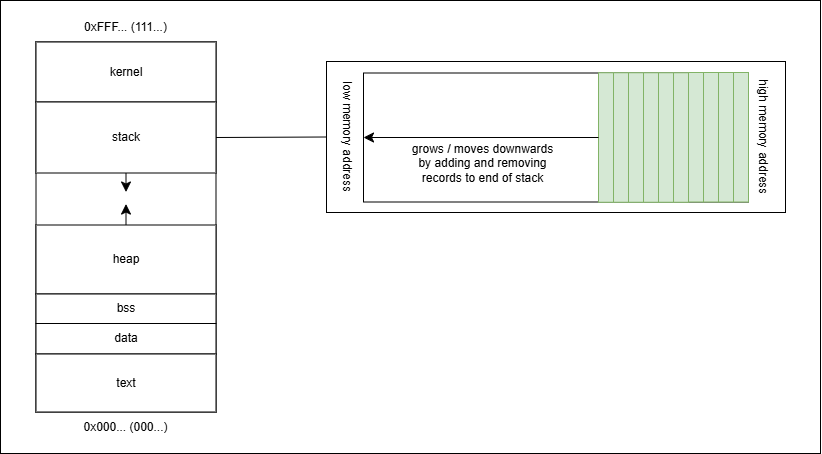
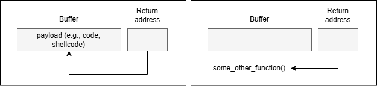
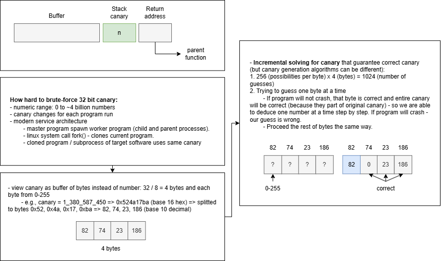

# Task 8 - Developing a simple exploit

## Description and theory
1. Objective: learn to find vulnerabilities in a vulnerable binary and write a simple exploit
2. [Virtual memory](https://en.wikipedia.org/wiki/Virtual_memory) - isolated chunk of memory given to running program / process by OS (combination of RAM, disk space with swap files / memory, etc.) which uses virtual memory address translation (from virtual address space to physical), [memory paging](https://en.wikipedia.org/wiki/Memory_paging) or [pages](https://en.wikipedia.org/wiki/Page_(computer_memory)), [memory protection mechanisms](https://en.wikipedia.org/wiki/Memory_protection), etc. In other words, each program is given it's own virtual address space that maps to completely different parts of the physical memory.
   - When C program is run by OS: start program in shell -> OS call `main` method of code as function -> actual process / executable will be held in memory in specific way (consistent between different processes). "Executable" means it is valid to run code from this memory.
   - Certain areas / sections / segments / regions of virtual memory are allocated to (just standard conventions or abstraction for dividing sections according their to special tasks):
     - [kernel space](https://en.wikipedia.org/wiki/User_space_and_kernel_space) - command line parameters passed to program, environment variables, etc. Appears at top of the virtual memory mapping, due to OS ["higher-half" kernel](https://wiki.osdev.org/Higher_Half_Kernel), but it isn't strictly true and may vary. It prevents the kernel interfering the program, usefull for system calls, and performance reasons. 
     - stack - temporary data storage for local veriables for each function, return addresses, and other runtime data.
     - heap - area for dynamic and large chunks of memory.
     - bss - [uninitialised](https://en.wikipedia.org/wiki/Uninitialized_variable) variables.
     - data - initialised variables.
     - text - loaded actual code of program (e.g., read-only machine instructions).
     - 
   - Heap and stack grow in directions towards each other (stack grows downwards, heap grows upwards), which might cause heap reaching the stack or vice versa (stack-heap collision / overlap). [Memory addresses](https://en.wikipedia.org/wiki/Memory_address) are depended on [разрядности систем / bit width](https://en.wikipedia.org/wiki/Word_(computer_architecture)) https://en.wikipedia.org/wiki/RAM_limit (like 16, 32, 64 bits). But this colission is not a серьозная problem in modern systems, due to: 
     - handling with paging, [PAE](https://en.wikipedia.org/wiki/Physical_Address_Extension), etc.
     - on 64-bit systems, they are theoretically "never reach", because it would require 2^64 addresses (~16 million TB of RAM).
     - on 32-bit systems, they are more potentially to totally reach - 2^32 addresses (~4 GB of RAM). It will cause [stack overflow](https://en.wikipedia.org/wiki/Stack_overflow) error, [heap overflow](https://en.wikipedia.org/wiki/Heap_overflow), command to allocate memory will fail (e.g., malloc will return NULL if insufficient memory available), [our-of-memory condition](https://en.wikipedia.org/wiki/Out_of_memory), and other issues.     
3. [Buffer overflow](https://en.wikipedia.org/wiki/Buffer_overflow) - type of low level memory exploits and vulnerabilities, such as [out-of-bounds read / buffer over-read](https://cwe.mitre.org/data/definitions/125.html) or [memory corruption](https://en.wikipedia.org/wiki/Memory_corruption), which can propagate malicious code and intrusion injection, privilege escalation, data corruption with bugs or errors, [memory leaks](https://en.wikipedia.org/wiki/Memory_leak), etc.
   - Example: [OpenSSL CVE-2014-0160](https://en.wikipedia.org/wiki/Heartbleed), and [others CVE](https://cve.mitre.org/cgi-bin/cvekey.cgi?keyword=buffer%20overflow).
   - Buffer overflow can happen in different areas of memory: [stack buffer overflow](https://en.wikipedia.org/wiki/Stack_buffer_overflow), [heap buffer overflow](https://cwe.mitre.org/data/definitions/122.html), global-buffer-overflow, etc.
   - Primary cause: trying to write longer or more string / variable / data into a [buffer](https://en.wikipedia.org/wiki/Data_buffer) that is only a certain length / capacity, so it overwrites and corrupts the later memory addresses. This vulnerability targets return address in order to take control of program execution (user-controled buffer overflow and controlling code execution).
   - Types of propagation:
     - jump to buffer (overwrite return address to point back into buffer to run some custom shellcode).
     - jump to pre-existing function.
     - 
   - [Solutions (protections, contermeasures, and mitigations)](https://en.wikipedia.org/wiki/Buffer_overflow_protection):
     - Randomising memory layout (randomizing address of the program in memory, so no one cannot calculate in advance how to pwn it): [ASLR (address space layout randomization)](https://en.wikipedia.org/wiki/Address_space_layout_randomization), [PIE (position independent executables) and PIC (position independent code)](https://en.wikipedia.org/wiki/Position-independent_code). It can be bypassed by [ROP chains (return-oriented programming attack)](https://en.wikipedia.org/wiki/Return-oriented_programming) that is able to get around randomized stack offsets and non-executable stack.
     - [Non-executable stacks (executable space protection)](https://en.wikipedia.org/wiki/Executable-space_protection):
       - disable executable stack - `execstack`.
       - built-in support of [NX-bit (non-executable bit)](https://en.wikipedia.org/wiki/NX_bit) - non executing data on the stack, so trying to execute a function or anything on the stack would cause an exception (like access violation), which Linux in turn would generate a signal (like SIGSEGV) and without a signal handler would kill the process. But can be bypassed with [return-to-libc attack](https://en.wikipedia.org/wiki/Return-to-libc_attack) for sensitive libc functions.
       - [DEP (data execution prevention](https://learn.microsoft.com/en-us/windows/win32/memory/data-execution-prevention) - memory permission checks in hardware and OS software sides. It marks stack as only `writable` (before it was both `writable` and `executable`, because no one even conceived about buffer overflows in past). It also applied "write XOR policy" / "W^X feature" (precident that memory location should being exclusively either `writable` or `executable`), but that is not a strict rule - [JIT (just-in-time compiler)](https://en.wikipedia.org/wiki/Just-in-time_compilation) violates that policy by dynamically generating and executing code on fly (it is semi-controversial point, because JIT may rotate between `writable` and `executable` states, but isn't in two states at the same time). Anywary, DEP doesn't stop buffer overflow that jumps to pre-existing functions.
     - Stack canary - compiler option (in gcc to enable: -fstack-protector, -fstack-protector-all, -fstack-protector-strong), which just randomly choose number that sits between any buffer and return address of the function, so attacker have to overwrite unknown canary in order to get to return address. When function is ready to return, before jumping to return address - canary is checked to make sure it is same as original value. If it is not same, it will trigger program to crash with "stack smashing detected terminated" (crashing is better than letting hackers to access something). Bypassing approaches: stack leak, guessing and brute-forcing the value and writing it back.
       - 
     - [Shadow stack](https://en.wikipedia.org/wiki/Shadow_stack), [Hardware-enforced Stack Protection](https://techcommunity.microsoft.com/blog/windowsosplatform/understanding-hardware-enforced-stack-protection/1247815), and seperate stack spaces.
     - Buffer checking: checking size of buffer required to accept data from external source (check if input's length is more than X). Also, provide all access only through defined methods that always check if location is withing allocated memory. Runtime bounds checking leads to impossible having buffer overflow, but it affects on performance cost (speed vs safety).
     - [Input validation](https://en.wikipedia.org/wiki/Data_validation) and sanitization (-fsanitize option), escaping output, code sandboxing, etc.
     - Dynamic allocation (buffer on heap memory instead of stack):
       - using "finite" / fixed size arrays for some input with fixed maximum length and putting them on stack.
       - for any other cases, using "infinite" / dynamic size structures (like std::vector in C++), which is resizable but creates some overhead.
     - Language design:
       - C doesn't have runtime [bounds / range checking](https://en.wikipedia.org/wiki/Bounds_checking)
       - not secure / unsafe functions of C: scanf, memcpy, strcopy, etc. And their safe versions _s or alternatives (e.g., strncopy, alloca)
       - C null-terminates strings vs C++ strings and series of bytes.
     - Different architectures: [Von Neumann architecture](https://en.wikipedia.org/wiki/Von_Neumann_architecture), [Harvard architecture](https://en.wikipedia.org/wiki/Harvard_architecture), and others.
     - Other types of protection from OS, compiler, hardware, software.

